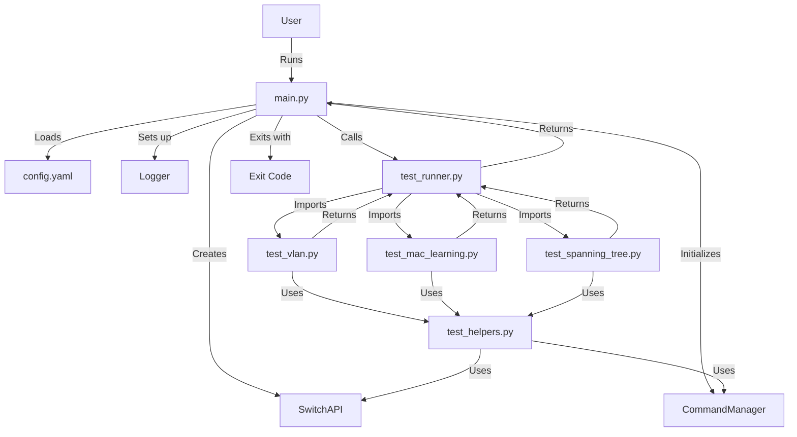

# Project Flow



## Detailed Flow

1. **Program Start** (`main.py`)
   - Parse command line arguments
   - Load configuration from `config.yaml`
   - Initialize logging
   - Create SwitchAPI instance
   - Initialize CommandManager

2. **Test Runner** (`test_runner.py`)
   - Import test modules
   - Set up test environment
   - Execute test suites in sequence:
     - VLAN tests
     - MAC learning tests
     - Spanning tree tests
   - Collect and report results

3. **Test Modules** (e.g., `test_vlan.py`)
   - Use CommandManager for switch commands
   - Use test helpers for common operations
   - Execute specific test cases
   - Return test results

4. **Helper Functions** (`test_helpers.py`)
   - Provide common test operations
   - Handle command execution
   - Manage test environment
   - Verify command responses

5. **Command Management** (`command_manager.py`)
   - Load commands from `switch_commands.json`
   - Format commands with parameters
   - Parse command responses
   - Handle command errors

6. **Switch API** (`switch_api.py`)
   - Manage switch connection
   - Execute commands
   - Handle switch responses
   - Manage switch state

7. **Program End** (`main.py`)
   - Report final results
   - Clean up resources
   - Exit with appropriate code

## Key Interactions

1. **Configuration Flow**
   ```
   config.yaml → main.py → CommandManager → Test Modules
   ```

2. **Command Flow**
   ```
   Test Module → CommandManager → SwitchAPI → Switch
   ```

3. **Test Execution Flow**
   ```
   main.py → test_runner.py → Test Modules → test_helpers.py
   ```

4. **Result Flow**
   ```
   Test Modules → test_runner.py → main.py → User
   ```

## Error Handling

1. **Configuration Errors**
   - Handled in `main.py`
   - Prevents test execution
   - Reports to user

2. **Switch Connection Errors**
   - Handled in `SwitchAPI`
   - Retries connection
   - Reports to test modules

3. **Command Errors**
   - Handled in `CommandManager`
   - Validates responses
   - Reports to test modules

4. **Test Errors**
   - Handled in test modules
   - Logs failures
   - Continues with next test

## Logging Flow

1. **Main Logging**
   - Program start/end
   - Configuration status
   - Overall test results

2. **Test Runner Logging**
   - Test suite execution
   - Environment setup
   - Test results summary

3. **Test Module Logging**
   - Individual test execution
   - Test-specific details
   - Test failures

4. **Helper Function Logging**
   - Common operations
   - Command execution
   - Response verification 